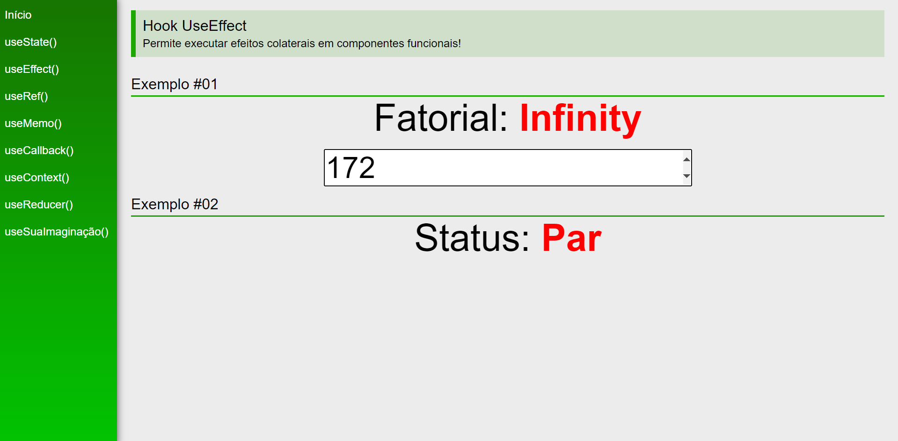

# React Guide - Hooks

- This project was made with the aim of practicing react.

# Design

- I based myself on the layout of the react documentation itself. This guide is not intended to contain long texts but to show on screen good examples of what you are finding in the codes

  

### `yarn start`

Runs the app in the development mode.\
Open [http://localhost:3000](http://localhost:3000) to view it in the browser.

The page will reload if you make edits.\
You will also see any lint errors in the console.